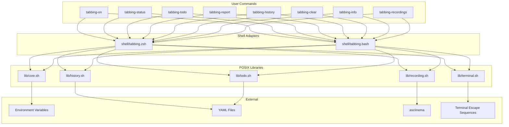

# Project Architecture

## Overview

tabbing-on is a shell utility for managing terminal tab state (title, status, emoji, urgency, color), per-tab todos, history tracking, and terminal recordings. It uses a **layered architecture**: POSIX-compatible shared libraries provide core logic, while shell-specific wrappers (Bash/Zsh) adapt syntax and hook into shell prompt mechanisms.

## System Diagram



## Core Components

| Component | File | Purpose |
|-----------|------|---------|
| Core | `lib/core.sh` | Color/emoji mapping, urgency levels, tab state rendering |
| Terminal | `lib/terminal.sh` | Terminal emulator detection, escape sequence abstraction |
| History | `lib/history.sh` | Tab ID generation, YAML event logging, search, reporting |
| Recording | `lib/recording.sh` | asciinema recording lifecycle management |
| Todo | `lib/todo.sh` | Per-tab todo CRUD with provider pattern |
| Zsh Adapter | `shell/tabbing.zsh` | Zsh functions, 1-based arrays, precmd hook |
| Bash Adapter | `shell/tabbing.bash` | Bash functions, 0-based arrays, PROMPT_COMMAND hook |
| Init | `bin/tabbing-init` | Outputs shell-appropriate `source` command |

## Layered Design

The codebase has three layers, each with a clear responsibility:

1. **POSIX Libraries** (`lib/*.sh`) -- Pure POSIX sh. No bash/zsh-isms. Prefixed `_tabbing_*`. Provide all data logic, terminal I/O, and persistence. Can be sourced by any POSIX-compatible shell.

2. **Shell Adapters** (`shell/tabbing.{bash,zsh}`) -- Source all five libraries, then define user-facing functions (`tabbing-on`, `tabbing-status`, etc.) using shell-specific features: array indexing (0-based vs 1-based), `[[ ]]` conditionals, prompt hooks (`PROMPT_COMMAND` vs `precmd`).

3. **Bootstrap** (`bin/tabbing-init`) -- POSIX `/bin/sh` script that resolves `TABBING_ROOT` and outputs the correct `source` line for the user's shell.

## State Management

**Runtime state** lives in exported environment variables scoped to the shell session:

| Variable | Scope | Set By |
|----------|-------|--------|
| `TAB_TITLE`, `TAB_STATUS`, `TAB_HIGHLIGHT`, `TAB_URGENCY`, `TAB_EMOJI` | Session | User commands |
| `TAB_ID` | Session | Auto-generated on first use |
| `TAB_TERMINAL` | Session | Auto-detected at init |
| `TAB_RECORDING` | Session | Recording lifecycle |

**Persistent state** uses YAML files under `$XDG_STATE_HOME/tabbing/` (default `~/.local/state/tabbing/`):

```
~/.local/state/tabbing/
├── history/{TAB_ID}.yaml       # Timestamped event log
├── todos/{TAB_ID}.yaml         # Todo items with status
└── recordings/{TAB_ID}/*.cast  # asciinema recordings
```

Each tab gets its own files keyed by `TAB_ID` (8-char hex from `/dev/urandom`).

## Terminal Abstraction

`lib/terminal.sh` detects the terminal emulator via environment variable probing and provides abstracted functions:

- **Title** (`_tabbing_send_title`): Universal OSC 0 escape -- works on all terminals
- **Tab color** (`_tabbing_send_tab_color`): iTerm2 OSC 6, Kitty remote control, no-op elsewhere
- **Badge** (`_tabbing_send_badge`): iTerm2 OSC 1337 only

Detection priority: iTerm2 > Ghostty > Kitty > WezTerm > Apple Terminal > Windows Terminal > Alacritty > Konsole > GNOME Terminal > tmux > xterm > unknown.

## Key Design Decisions

- **POSIX library layer**: Maximizes portability; only shell adapters use bash/zsh features
- **Environment variables for state**: Natural fit for shell tools -- state persists across commands within a session without file I/O
- **YAML persistence**: Human-readable, no external dependencies (parsed via `sed`/`awk`)
- **Per-tab isolation**: Each tab gets a unique ID and independent history/todos/recordings
- **Provider pattern in todos**: `lib/todo.sh` is designed for pluggable backends via `TAB_TODO_PROVIDER`
- **No external dependencies**: Everything works with standard POSIX utilities; asciinema is optional for recordings
