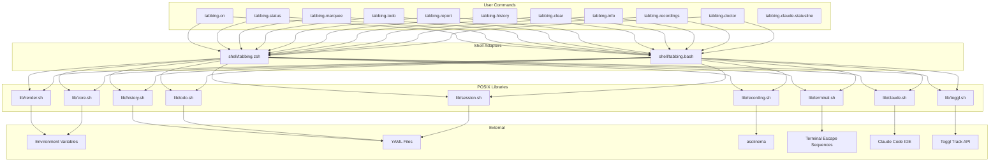

# Project Architecture

## Overview

tabbing-on is a shell utility for managing terminal tab state (title, status, emoji, urgency, color), per-tab todos, history tracking, and terminal recordings. It uses a **layered architecture**: POSIX-compatible shared libraries provide core logic, while shell-specific wrappers (Bash/Zsh) adapt syntax and hook into shell prompt mechanisms.

## System Diagram


```mermaid
graph TB
    subgraph "User Commands"
        TO[tabbing-on]
        TS[tabbing-status]
        TM[tabbing-marquee]
        TT[tabbing-todo]
        TR[tabbing-report]
        TH[tabbing-history]
        TC[tabbing-clear]
        TI[tabbing-info]
        TRC[tabbing-recordings]
        TD[tabbing-doctor]
        TCS[tabbing-claude-statusline]
    end

    subgraph "Shell Adapters"
        ZSH[shell/tabbing.zsh]
        BASH[shell/tabbing.bash]
    end

    subgraph "POSIX Libraries"
        REND[lib/render.sh]
        CORE[lib/core.sh]
        TERM[lib/terminal.sh]
        HIST[lib/history.sh]
        REC[lib/recording.sh]
        SESS[lib/session.sh]
        TODO[lib/todo.sh]
        CLAUDE[lib/claude.sh]
        TOGGL[lib/toggl.sh]
    end

    subgraph "External"
        ENV[Environment Variables]
        YAML[YAML Files]
        ASC[asciinema]
        ESC[Terminal Escape Sequences]
        CCIDE[Claude Code IDE]
        TOGAPI[Toggl Track API]
    end

    TO & TS & TM & TT & TR & TH & TC & TI & TRC & TD --> ZSH & BASH
    ZSH & BASH --> REND & CORE & TERM & HIST & REC & SESS & TODO & CLAUDE & TOGGL
    REND & CORE --> ENV
    TERM --> ESC
    HIST & TODO --> YAML
    SESS --> YAML
    REC --> ASC
    CLAUDE --> CCIDE
    TOGGL --> TOGAPI
```

## Core Components

| Component | File | Purpose |
|-----------|------|---------|
| Render | `lib/render.sh` | Minimal render pipeline for prompt hook: title display, color/emoji validation |
| Core | `lib/core.sh` | Color/emoji mapping, urgency levels, help, YAML escape |
| Terminal | `lib/terminal.sh` | Terminal emulator detection, escape sequence abstraction |
| History | `lib/history.sh` | Tab ID generation, YAML event logging, search, reporting |
| Recording | `lib/recording.sh` | asciinema recording lifecycle management |
| Session | `lib/session.sh` | Per-session state persistence via `TAB_SESSION`-keyed env files |
| Todo | `lib/todo.sh` | Per-tab todo CRUD with provider pattern |
| Claude Bridge | `lib/claude.sh` | Claude Code IDE statusline bridge via FIFO + state file |
| Toggl | `lib/toggl.sh` | Toggl Track API integration for time entry lifecycle |
| Statusline | `bin/tabbing-claude-statusline` | Claude Code statusline script (reads state file) |
| Zsh Adapter | `shell/tabbing.zsh` | Zsh functions, 1-based arrays, precmd hook |
| Bash Adapter | `shell/tabbing.bash` | Bash functions, 0-based arrays, PROMPT_COMMAND hook |
| Init | `bin/tabbing-init` | Outputs shell-appropriate `source` command |

## Layered Design

The codebase has three layers, each with a clear responsibility:

1. **POSIX Libraries** (`lib/*.sh`) -- Pure POSIX sh. No bash/zsh-isms. Prefixed `_tabbing_*`. Provide all data logic, terminal I/O, and persistence. Can be sourced by any POSIX-compatible shell.

2. **Shell Adapters** (`shell/tabbing.{bash,zsh}`) -- Source render.sh at init (lightweight), then define user-facing functions (`tabbing-on`, `tabbing-status`, etc.) using shell-specific features: array indexing (0-based vs 1-based), `[[ ]]` conditionals, prompt hooks (`PROMPT_COMMAND` vs `precmd`).

3. **Bootstrap** (`bin/tabbing-init`) -- POSIX `/bin/sh` script that resolves `TABBING_ROOT` and outputs the correct `source` line for the user's shell.

## State Management

**Runtime state** lives in exported environment variables scoped to the shell session:

| Variable | Scope | Set By |
|----------|-------|--------|
| `TAB_TITLE`, `TAB_STATUS`, `TAB_HIGHLIGHT`, `TAB_URGENCY`, `TAB_EMOJI` | Session | User commands |
| `TAB_ID` | Session | Auto-generated on first use |
| `TAB_TERMINAL` | Session | Auto-detected at init |
| `TAB_RECORDING` | Session | Recording lifecycle |
| `TAB_SESSION` | Session | Session fingerprint for state file scoping |

**Persistent state** uses YAML files under `$XDG_STATE_HOME/tabbing/` (default `~/.local/state/tabbing/`):

```
~/.local/state/tabbing/
├── history/{TAB_ID}.yaml              # Timestamped event log
├── todos/{TAB_ID}.yaml                # Todo items with status
├── recordings/{TAB_ID}/*.cast         # asciinema recordings
├── sessions/{TAB_SESSION}.env         # Persisted env state for CLI wrappers
├── claude-{TAB_SESSION}.pipe          # Named pipe (FIFO) for Claude bridge IPC
├── claude-{TAB_SESSION}.state         # Flat key=value state read by statusline
└── claude-bridge-{TAB_SESSION}.pid    # PID of background bridge reader process
```

Each tab gets its own files keyed by `TAB_ID` (8-char hex from `/dev/urandom`).

## Terminal Abstraction

`lib/terminal.sh` detects the terminal emulator via environment variable probing and provides abstracted functions:

- **Title** (`_tabbing_send_title`): Universal OSC 0 escape -- works on all terminals
- **Tab color** (`_tabbing_send_tab_color`): iTerm2 OSC 6, Kitty remote control, no-op elsewhere
- **Badge** (`_tabbing_send_badge`): iTerm2 OSC 1337 only

Detection priority: iTerm2 > Ghostty > Kitty > WezTerm > Apple Terminal > Windows Terminal > Alacritty > Konsole > GNOME Terminal > tmux > xterm > unknown.

## Key Design Decisions

- **POSIX library layer**: Maximizes portability; only shell adapters use bash/zsh features
- **Environment variables for state**: Natural fit for shell tools -- state persists across commands within a session without file I/O
- **YAML persistence**: Human-readable, no external dependencies (parsed via `sed`/`awk`)
- **Per-tab isolation**: Each tab gets a unique ID and independent history/todos/recordings
- **Provider pattern in todos**: `lib/todo.sh` is designed for pluggable backends via `TAB_TODO_PROVIDER`
- **No external dependencies**: Everything works with standard POSIX utilities; asciinema is optional for recordings
- **Claude bridge via FIFO**: Named pipe decouples render pipeline from IDE statusline — render writes to pipe, background reader persists to flat file, statusline script reads file. No polling, no coupling
- **Toggl integration is opt-in**: Requires `TAB_TOGGL_TOKEN`; mirrors task lifecycle to Toggl time entries with idle detection and heartbeat monitoring
