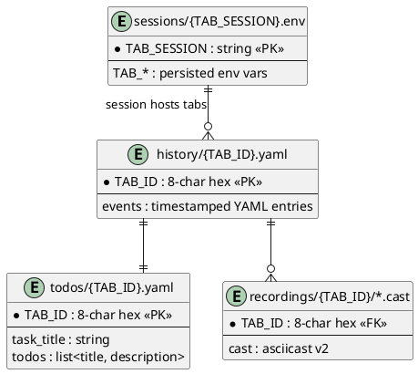

# Project Schema

> **No persistence layer.** tabbing-on has **no SQL database, no Liquibase
> changelogs, and no ORM models**. Runtime state lives in exported `TAB_*`
> environment variables; durable state is a flat tree of YAML / `.env` /
> text files under `~/.local/state/tabbing/` (XDG). This document is the
> schema reference for those artifacts: env-var state, on-disk file formats,
> the theme data blob, and the CLI flag grammar. Escape-construction and
> parsing internals are covered in [PROJ-ARCH.md](PROJ-ARCH.md); the blob's
> line map in full detail in [theme-data-format.md](theme-data-format.md).

## 1. Runtime state — `TAB_*` environment variables

The live tab state is the set of exported env vars below. They are set in the
interactive shell, mirrored to disk by `sessions/{TAB_SESSION}.env`, and are
the canonical input to every render/emit path.

| Variable | Type | Description |
|----------|------|-------------|
| `TAB_ID` | 8-char hex | Stable per-tab identity (primary key for history/todos/recordings) |
| `TAB_SESSION` | string | Per-terminal-session key (keys the `.env` state file) |
| `TAB_TITLE` | string | Current tab title text |
| `TAB_STATUS` | string | Status text shown with the title |
| `TAB_HIGHLIGHT` | color | Highlight color (name, `#RRGGBB`, or X11 name) |
| `TAB_BG` | color | Status background color |
| `TAB_EMOJI` | name | Named emoji shown in the title |
| `TAB_URGENCY` | enum | Urgency level (`on`/`off`/bell levels) |
| `TAB_TERMINAL` | string | Detected terminal emulator id |
| `TAB_THEME` | name | Active theme name |
| `TAB_THEME_DATA` | 383-line blob | Full serialized theme (see §4) |
| `TAB_MARQUEE` | string | Active scrolling marquee text |
| `TAB_RECORDING` | path | Active asciinema recording file |

## 2. Configuration environment

Precedence throughout: **CLI flag → env var → built-in default**.

### Toggl integration (`lib/toggl.sh`, `toggl.rs`)

| Variable | Required | Default | Description |
|----------|----------|---------|-------------|
| `TAB_TOGGL_TOKEN` | yes | — | Toggl API token |
| `TAB_TOGGL_WORKSPACE` | prompted | — | Workspace ID |
| `TAB_TOGGL_PROJECT` | prompted | — | Project ID |
| `TAB_TOGGL_CLIENT` | no | — | Client ID |
| `TAB_TOGGL_BILLABLE` | no | `false` | Billable flag |
| `TAB_TOGGL_DURATION` | no | `1800` | Heartbeat interval (s) |
| `TAB_TOGGL_INACTIVE_WARN` | no | `300` | Idle check interval (s) |
| `TAB_TOGGL_PREFIX` | no | `TABO-{repo}` | Entry description prefix |
| `TAB_TOGGL_CREATED_WITH` | no | `TABO` | `created_with` field |
| `TAB_TOGGL_ENTRY_ID` | runtime | — | Current time-entry ID |

### Voice-memo pipeline (`tabbing-plan` / `task-memo`, `rust/src/plan/`)

| Variable | Description |
|----------|-------------|
| `LITELLM_API_URL` | LiteLLM endpoint (transcription + classification) |
| `LITELLM_API_KEY` | LiteLLM API key |
| `M2T_MODEL` | Classification model name |
| `M2T_WHISPER_MODEL` | Whisper transcription model name |

### Behavior / plumbing

| Variable | Description |
|----------|-------------|
| `TABBING_THEME_BIN` | Override path to the `tabbing` binary used for `tabbing-theme emit` |
| `TABBING_THEME_PERSIST` | `1` re-enables per-prompt theme re-emit (disabled by default) |
| `DC_TAB_NS` | direnv-config tab namespace (default `tab`) |
| `XDG_STATE_HOME` | Base for state tree (default `~/.local/state`) |
| `XDG_CONFIG_HOME` | Base for user themes (default `~/.config`) |
| `XDG_RUNTIME_DIR` | Base for daemon pid files (default `$TMPDIR`) |

## 3. On-disk state tree

Root: `${XDG_STATE_HOME:-~/.local/state}/tabbing/`

| Path | Format | Written by | Contents |
|------|--------|-----------|----------|
| `history/{TAB_ID}.yaml` | YAML append log | `lib/history.sh`, `history.rs` | Timestamped events (`init`, `title`, `status`, `emoji`, `urgency`, `todo_add`, `todo_switch`, recording events); each entry carries `title:` / `status:` / `recording:` as YAML-escaped strings |
| `todos/{TAB_ID}.yaml` | YAML | `lib/todo.sh`, `todo.rs` | `task_title:` (tab title) + `todos:` list of `title:` / `description:` items |
| `sessions/{TAB_SESSION}.env` | dotenv | `lib/session.sh` | Persisted `TAB_*` vars for CLI wrappers; sourced by `_tabbing-wrapper` |
| `recordings/{TAB_ID}/*.cast` | asciicast v2 | `lib/recording.sh` | asciinema terminal recordings |
| `claude-{SESSION}.state` | shell vars | `lib/claude.sh` | Claude Code IDE bridge state |
| `claude-{SESSION}.pipe` | FIFO | `lib/claude.sh` | Named pipe for Claude Code IPC |
| `tabbing-daemon.{TAB_SESSION}.pid` | pid file | `lib/dc.sh` | Background daemon lifecycle |

### Entity relationships (file-level)

```mermaid
erDiagram
    TAB_SESSION ||--|| sessions_env : "persists to"
    TAB_SESSION ||--o{ TAB_ID : "terminal hosts tabs"
    TAB_ID ||--|| history_yaml : "event log"
    TAB_ID ||--|| todos_yaml : "todo list"
    TAB_ID ||--o{ recordings_cast : "has many"
    TAB_ID }o--|| claude_state : "bridge state per session"

    sessions_env {
        string TAB_SESSION PK
        string TAB_* "persisted env vars"
    }
    history_yaml {
        string TAB_ID PK
        yaml_entries "timestamped events"
    }
    todos_yaml {
        string TAB_ID PK
        string task_title
        list todos
    }
```



## 4. Theme formats

### `~/.config/tabbing-on/themes/<name>.theme` — human-authored

`key = value` lines, `#` comments. Keys: `bg`, `fg`, `cursor` (required:
bg/fg), `color0`–`color15` (missing entries default to fg; color0/color8 to
bg), optional `ps1_layout` (`default|minimal|compact|full|two-line|git|tab-status|custom`)
and `ps1`. Values are `#RRGGBB`. Example: `shell-impl/examples/themes/my-dark.theme`.

### `<name>.themedata` / `$TAB_THEME_DATA` — compiled blob

One newline-delimited blob of **383 lines**, line number = lookup key (SGR
codes, mnemonic OSC numbers 110–119, and palette slots at `128 + slot`).
Values: `#RRGGBB`, named ANSI color, X11 symbolic name (resolved via
`shell-impl/data/colors.txt`, 657 names, `name|#RRGGBB` per line), or
`on`/`off`. Persisted verbatim to `themes/<name>.themedata`; full line map in
[theme-data-format.md](theme-data-format.md).

## 5. CLI flag grammar (excerpt)

```sh
tabbing-on "Title" [-color FG [-bg BG]] [-status TEXT] [-emoji NAME] [-urgency LVL]
tabbing-theme get <handle> [name] | set <handle> <value> [name]
tabbing-theme gen-standard [name] | gen-ramp <from> <to> <steps>
tabbing-theme emit [--all | --clear | --clear-bg | --bg COLOR]
                   [--title TEXT] [--tab-color C]
                   [--cursor STYLE] [--blink off] [--raw]
tabbing-init bash|zsh
```

`emit` prints an eval-able `printf` payload (raw bytes with `--raw`); all
OSC/CSI construction lives in the Rust binary.

## Maintenance Checklist

- [ ] `TAB_*` var list matches `state.rs` / `lib/*.sh`
- [ ] State-tree paths match `_tabbing_*_dir` helpers
- [ ] Theme line count (383) still matches `theme-data.sh` / `theme_data.rs`
- [ ] Flag grammar matches `main.rs` dispatch + `bin/` wrappers
