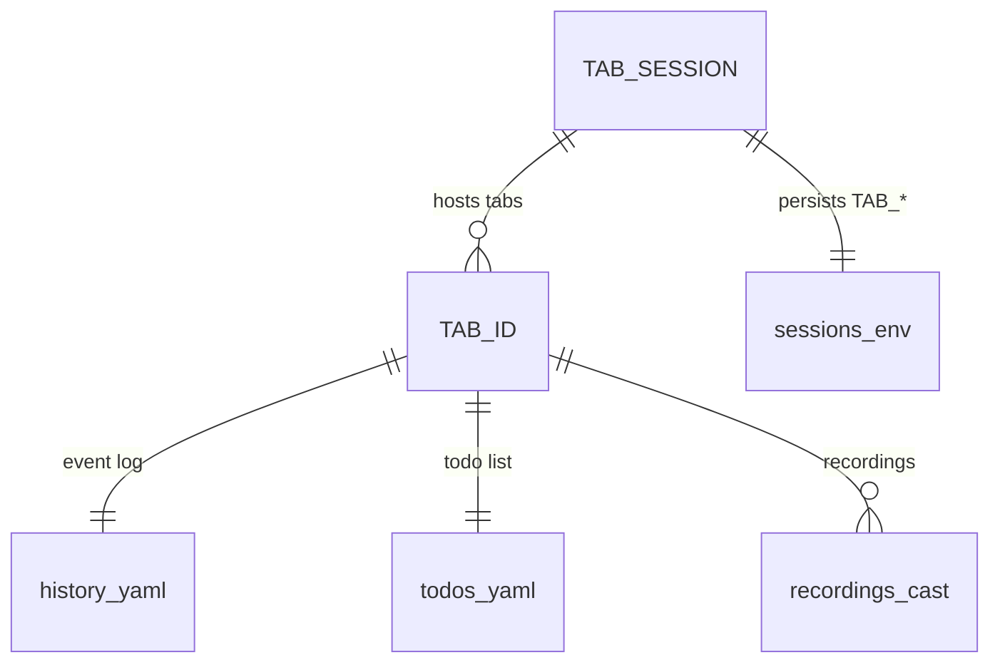

# Project Schema — Summary

> **No persistence layer** — no SQL DB, no Liquibase, no ORM. State = `TAB_*`
> env vars + flat files under `${XDG_STATE_HOME:-~/.local/state}/tabbing/`.
> Full reference: [PROJ-SCHEMA.md](PROJ-SCHEMA.md)

## Artifacts at a glance

| Artifact | Format | Key |
|----------|--------|-----|
| `history/{TAB_ID}.yaml` | YAML append log (timestamped events) | `TAB_ID` |
| `todos/{TAB_ID}.yaml` | YAML (`task_title` + `todos` list) | `TAB_ID` |
| `sessions/{TAB_SESSION}.env` | dotenv of persisted `TAB_*` vars | `TAB_SESSION` |
| `recordings/{TAB_ID}/*.cast` | asciicast v2 | `TAB_ID` |
| `claude-{SESSION}.state` / `.pipe` | shell vars / FIFO | `TAB_SESSION` |
| `themes/<name>.theme` | `key = value` (bg, fg, cursor, color0–15, ps1_layout) | theme name |
| `themes/<name>.themedata` | 383-line blob, line# = key (SGR/OSC/palette) | theme name |
| `data/colors.txt` | X11 color DB, `name\|#RRGGBB` (657 names) | — |

## Key env vars

- **State**: `TAB_ID`, `TAB_SESSION`, `TAB_TITLE`, `TAB_STATUS`, `TAB_HIGHLIGHT`,
  `TAB_BG`, `TAB_EMOJI`, `TAB_URGENCY`, `TAB_TERMINAL`, `TAB_THEME`,
  `TAB_THEME_DATA`, `TAB_MARQUEE`, `TAB_RECORDING`
- **Toggl**: `TAB_TOGGL_{TOKEN,WORKSPACE,PROJECT,CLIENT,BILLABLE,DURATION,INACTIVE_WARN,PREFIX,CREATED_WITH,ENTRY_ID}`
- **Plan pipeline**: `LITELLM_API_URL`, `LITELLM_API_KEY`, `M2T_MODEL`, `M2T_WHISPER_MODEL`
- **Plumbing**: `TABBING_THEME_BIN`, `TABBING_THEME_PERSIST`, `DC_TAB_NS`,
  `XDG_STATE_HOME`, `XDG_CONFIG_HOME`

## Relationships

Config precedence everywhere: **CLI flag → env var → default**.
